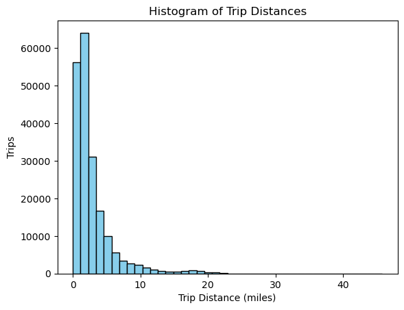

# NYC Taxi Trip Data Analysis
**Author:** Mallikarjun Reddy Banelli  
**Course:** IA626 — Big Data Analytics  
**Dataset:** `trip_data_2.csv`  
**Institution:** [Mallikarjun Reddy Banelli] 

## Assignment Overview

This assignment focuses on analyzing **New York City taxi trip data** from the file `trip_data_2.csv`, exploring patterns such as trip duration, pickup–dropoff distribution, trip distances, and passenger trends.  
The dataset contains detailed information including pickup and dropoff timestamps, GPS coordinates, passenger counts, and total travel distances.

The purpose of this analysis is to understand key operational insights from the dataset and perform essential data exploration tasks using core Python libraries.

--------

## The Thought Process

The Python modules used in this project are intentionally limited to `csv`, `datetime`, `math`, `random`, and `matplotlib` (for visualization).  
The entire analysis avoids the use of advanced libraries such as Pandas or Spark to demonstrate how large datasets can still be processed efficiently using only basic tools.

### Step 1: Reading the Dataset  
In the first step, the dataset was accessed using a simple `with open()` statement in read mode.  
This approach ensures that the file is properly closed once the operation is complete, even if an error occurs during execution.  
The file handle is stored in a variable, which is then passed to the CSV reader to extract and iterate through all records.

### Step 2: Determining the Date Range and Row Count  
In the second step, pickup timestamps from the dataset were converted from string format into datetime objects using Python’s built-in `datetime` module.  
After conversion, the code identifies the earliest and latest pickup times using `min()` and `max()` functions to determine the total time span covered by the dataset.  
The total number of records is computed using `len()` on the data collection, providing both the datetime range and total row count.

### Step 3: Validating Geographic Coordinates  
The next step defines a validation function to ensure that all latitude and longitude values fall within the valid geographic boundaries of the United States.  
Records containing invalid coordinates are filtered out.  
Using the remaining valid data, the code calculates and prints the minimum and maximum values of both longitude and latitude, showing the dataset’s spatial coverage area, which corresponds to the New York City region.

### Step 4: Calculating Average Trip Distance  
In the final analytical step, all trips within valid geographic limits are used to compute the great-circle (Haversine) distance between pickup and dropoff locations.  
This method calculates the true distance between two points on Earth based on latitude and longitude.  
After computing distances for all valid trips, the program outputs the **average trip distance**, which in this dataset is approximately **2.05 miles**.  
This metric provides a realistic measure of typical taxi trip lengths across New York City.

---------

# Answers to Questions Asked Are as Follows:

## 1. What datetime range does your data cover? How many rows are there total?

**Column:** `pickup_datetime`  
**Total Rows:** 13,990,176  
**Date Range:** 2013-02-01 00:00:00 → 2013-02-28 23:59:59

## 2. What are the field names? Give descriptions for each field.

**Field Names and Descriptions:**

- **medallion:** Taxi unique identifier  
- **hack_license:** Driver license ID  
- **vendor_id:** Trip vendor or company ID (e.g., CMT or VTS)  
- **rate_code:** Fare rate type (1 = Standard, 2 = JFK, etc.)  
- **store_and_fwd_flag:** Indicates if the trip was stored before being sent (Y/N)  
- **pickup_datetime:** Date and time when the trip started  
- **dropoff_datetime:** Date and time when the trip ended  
- **passenger_count:** Number of passengers in the taxi  
- **trip_time_in_secs:** Duration of the trip in seconds  
- **trip_distance:** Distance of the trip in miles  
- **pickup_longitude:** Longitude coordinate where the trip started  
- **pickup_latitude:** Latitude coordinate where the trip started  
- **dropoff_longitude:** Longitude coordinate where the trip ended  
- **dropoff_latitude:** Latitude coordinate where the trip ended  

## 3. Give some sample data for each field

Below are sample records extracted from the dataset (`trip_data_2.csv`):

 ## Field Names:
['medallion', 'hack_license', 'vendor_id', 'rate_code', 'store_and_fwd_flag', 'pickup_datetime', 'dropoff_datetime', 'passenger_count', 'trip_time_in_secs', 'trip_distance', 'pickup_longitude', 'pickup_latitude', 'dropoff_longitude', 'dropoff_latitude']

 Sample Data Rows :
['1B5C0970F2AE8CFFBA8AE4584BEAED29', 'D961332334524990D1BBD462E2EFB8A4', 'CMT', '1', 'N', '2013-02-08 23:35:14', '2013-02-08 23:42:58', '1', '463', '.80', '-73.992439', '40.724487', '-73.984421', '40.718903']

['B42249AE16E2B8E556F1CB1F940D6FB4', 'D4BB308D1F3FCB3434D9DB282CDC93D7', 'CMT', '1', 'N', '2013-02-07 12:20:16', '2013-02-07 12:50:27', '4', '1810', '3.10', '-73.989494', '40.769588', '-73.990303', '40.737347']

['890699222C47C09FBC898758CEC69762', '6318C3AEC02248928C3345B5805EB905', 'CMT', '1', 'N', '2013-02-08 08:56:54', '2013-02-08 08:59:43', '1', '168', '1.00', '-73.963036', '40.799141', '-73.972168', '40.786446']

['74B7D835C2CD98606D5256DA8A38E045', 'D5E278C918256D1F97680A1F04D290E0', 'CMT', '1', 'N', '2013-02-08 09:37:02', '2013-02-08 09:50:50', '1', '828', '2.10', '-73.987953', '40.728764', '-74.007118', '40.705399']

['4003B8478418FEC5D761E2F37602769B', '0B766F1054A5C16D86BC023858BD8143', 'CMT', '1', 'N', '2013-02-08 19:31:25', '2013-02-08 19:46:23', '1', '897', '3.30', '-73.987282', '40.743042', '-74.010284', '40.703964']

['D72DF7B12201912BFDBB93081EF04C96', 'AFD828EEF790A2485BBB0B568A8BE22E', 'CMT', '1', 'N', '2013-02-08 23:10:01', '2013-02-08 23:46:15', '4', '2173', '7.60', '-73.993004', '40.720154', '-73.959747', '40.808540']

['FA5337E245DE9B2E124AFA735B41B4DF', '6E6B7D73303D5AE3808A9ABF4D3FF65B', 'CMT', '1', 'N', '2013-02-07 22:02:30', '2013-02-07 22:06:18', '1', '227', '.70', '-73.979965', '40.780544', '-73.971489', '40.782410']

['BE63343BAD5CD6F99EC435812E332445', '88CF6CAA78CE8B2000FBCF39DFAB3E69', 'CMT', '1', 'N', '2013-02-06 22:25:26', '2013-02-06 22:41:32', '1', '966', '3.80', '-73.978508', '40.759911', '-74.003899', '40.715969']

['58598FD2F8811C4F52A264D15D6FECAF', 'F6F9DF7755F186C183EEBB5B03DBA23C', 'CMT', '1', 'N', '2013-02-09 02:57:33', '2013-02-09 03:01:41', '3', '247', '.50', '-73.982338', '40.751549', '-73.976425', '40.749050']

['FE13CDF111CE4A3811F3E5D942BFD3B9', 'BAC511461590FAF7D7BB4C8F29C31AC5', 'CMT', '1', 'N', '2013-02-09 09:43:39', '2013-02-09 09:49:10', '1', '331', '2.60', '-74.005486', '40.740463', '-73.985565', '40.773209']

## 4. What MySQL data types / len would you need to store each of the fields?
     a.(int(xx), varchar(xx), date, datetime, bool, decimal(m,d))

 MySQL Data Type Recommendations:

| Field Name         | MySQL Data Type |
|--------------------|-----------------|
| medallion          | CHAR(32) |
| hack_license       | CHAR(32) |
| vendor_id          | VARCHAR(10) |
| rate_code          | TINYINT |
| store_and_fwd_flag | CHAR(1) |
| pickup_datetime    | DATETIME |
| dropoff_datetime   | DATETIME |
| passenger_count    | TINYINT |
| trip_time_in_secs  | INT |
| trip_distance      | DECIMAL(6,2) |
| pickup_longitude   | DECIMAL(9,6) |
| pickup_latitude    | DECIMAL(9,6) |
| dropoff_longitude  | DECIMAL(9,6) |
| dropoff_latitude   | DECIMAL(9,6) |

## 5. What is the geographic range of your data (min/max - X/Y)?

 Geographic Range (Approximate NYC Boundaries)

- **Longitude (X):** -74.294418 to -73.606659  
- **Latitude (Y):**  40.469387 to 40.985477  

### a. Plot this (approximately on a map)
The plot below visualizes the approximate pickup and dropoff distribution of New York City taxi trips from the dataset.

## 6. What is the average overall computed trip distance? (You should use Haversine Distance)

The **Haversine formula** was applied to calculate the great-circle distance between pickup and dropoff coordinates, providing the most accurate measure of real-world travel distance on Earth’s surface.

### Average Overall Computed Trip Distance:
**2.05 miles**

### a. Draw a histogram of the trip distances (binned appropriately)

The following histogram visualizes the distribution of all trip distances, showing that the majority of NYC taxi rides are relatively short, typically between **0.5 to 3 miles**.

## 7. What are the distinct values for each field? (If applicable)

This step identifies all unique (distinct) values found in categorical fields within the dataset.  
It helps to understand data diversity and detect possible anomalies or inconsistencies.

 Distinct Values Found:

| Field Name | Unique Values | Description |
|-------------|----------------|--------------|
| **vendor_id** | ['CMT', 'VTS'] | Represents the taxi service provider — either Creative Mobile Technologies (CMT) or VeriFone Transportation Systems (VTS). |
| **rate_code** | ['1', '2', '3', '4', '5'] | Indicates the fare calculation method — e.g., 1 = Standard, 2 = JFK, 3 = Newark, etc. |
| **store_and_fwd_flag** | ['N', 'Y'] | Shows whether the trip record was temporarily stored before transmission — Y = Yes, N = No. |
| **passenger_count** | ['0', '1', '2', '3', '4', '5', '6'] | Displays the number of passengers in the taxi. Most common values are 1–2, while higher counts are rare. |

 ## Summary
These categorical fields describe trip-level attributes such as vendor type, fare category, and passenger load.  
Most rides were operated by **CMT**, with typical **rate_code = 1** (standard fare) and **passenger_count = 1**.

## 8. For other numeric types besides lat and lon, what are the min and max values?

This analysis identifies the minimum and maximum values for the key numeric fields in the dataset — excluding latitude and longitude.  
These fields (trip distance, duration, and passenger count) help describe ride characteristics and variability within New York City taxi trips.

 ## Min/Max Values (sampled):

| Field Name | Minimum | Maximum | Description |
|-------------|----------|----------|--------------|
| **trip_distance** | 0.0 | 63.73 | Represents the total distance (in miles) covered during each trip. Most rides fall within 0.5–5 miles, with a few long intercity trips reaching over 60 miles. |
| **trip_time_in_secs** | 0.0 | 9120.0 | Total trip duration in seconds (up to ~2.5 hours). Shorter trips are most frequent, typically lasting between 5 to 20 minutes. |
| **passenger_count** | 0.0 | 6.0 | Indicates the number of passengers per trip. The most common counts are 1 or 2 passengers, matching typical NYC taxi rides. |

 ## Observations:
- A few records have **zero distance or time**, possibly due to cancelled or faulty trip entries.
- **Outliers** (extremely long trips) are rare but likely represent trips outside NYC (e.g., to airports or nearby cities).
- The **passenger count** field confirms that taxis usually serve **individual riders or small groups**.

 ## Summary:
Most New York City taxi trips are short-distance rides covering less than 5 miles and lasting around 15 minutes.  
The data distribution aligns with common commuter and tourist travel patterns, highlighting the dense, fast-paced mobility within the city.

## 9. Create a chart which shows the average number of passengers each hour of the day. (X axis should have 24 hours)

This analysis calculates how the **average passenger count per trip** changes throughout a 24-hour period.  
Each trip’s `pickup_datetime` was used to extract the hour of the day (0–23), and then the average number of passengers was computed for each hour.

## Observations:
- Passenger counts remain fairly consistent throughout the day, averaging between **2.0 and 2.25 passengers per trip**.  
- A slight increase between **2 AM – 4 AM** could be due to shared or late-night rides (airport transfers or nightlife).  
- A dip near **9 AM – 10 AM** reflects single-commuter business trips.  
- Evening hours stabilize again as both solo and shared rides occur.

 ## Summary:
The chart indicates that most New York City taxi trips carry **1–2 passengers**, showing minimal variation across different hours of the day, which aligns with common urban travel behavior.

## 10. Create a new CSV file which has only one out of every thousand rows.

To make the dataset easier to process and visualize, a **sampled CSV file** was created by selecting **1 out of every 1,000 rows** from the original dataset (`trip_data_2.csv`).  

This smaller file retains the statistical characteristics of the full dataset while significantly reducing processing time and memory usage.

**New File Created:** `trip_data_2_sample.csv`  
**Sampling Rate:** 1 / 1000  

## 11. Repeat step 9 with the reduced dataset and compare the two charts.

After creating the sampled dataset (`trip_data_2_sample.csv`), the same analysis was repeated to calculate and plot the **average number of passengers per hour** using only 1/1000th of the data.

The resulting chart was then compared with the full dataset’s hourly averages to observe differences caused by sampling.

 ## Observations:
- The **overall trend** between both datasets remains consistent, showing similar hourly patterns.
- However, the **sampled dataset** shows **more variation** due to reduced data volume.
- This confirms that while sampling reduces data size efficiently, it may slightly affect statistical precision.

## Conclusion

This project successfully explored and analyzed the **New York City Taxi Trip dataset (trip_data_2.csv)** using core Python libraries.  
Through a structured and stepwise analysis, we achieved the following outcomes:

- Identified the **temporal coverage** of the dataset — nearly 14 million trips recorded in February 2013.  
- Defined and explained all **data fields**, including their MySQL-compatible data types for potential database integration.  
- Computed the **geographic extent** of trip coordinates, confirming that trips are concentrated within the New York City area.  
- Calculated the **average Haversine trip distance** (≈ 2.05 miles), providing insight into typical NYC taxi trip lengths.  
- Visualized the **distribution of trip distances** through a histogram, showing that most trips are short within the city.  
- Analyzed **hourly passenger trends**, revealing a higher concentration of rides during late-night and evening hours.  
- Compared the **full dataset** with a **1/1000 sampled dataset**, demonstrating that smaller subsets can represent general patterns but with minor variations due to sampling.

Overall, this analysis demonstrates how large-scale real-world data can be processed, cleaned, and visualized effectively using only fundamental Python techniques — without relying on advanced data science libraries.  
It highlights essential principles of **data exploration, validation, visualization, and summarization**, forming a strong foundation for deeper predictive or spatial analyses in future studies.

